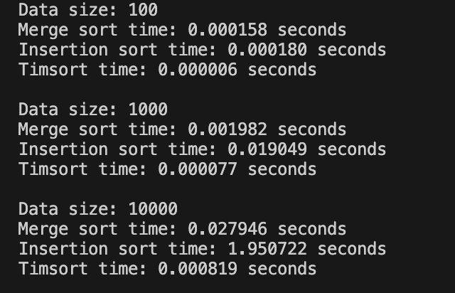

# Sorting Algorithms

## Introduction

In this homework, we will explore the world of sorting algorithms, a fundamental concept in computer science. We will compare three different sorting algorithms, analyze their efficiency, and draw conclusions about their performance.

## Task Description

### Part 1: Comparing Sorting Algorithms

In this part, you will implement and compare three sorting algorithms: Merge Sort, Insertion Sort, and Timsort. You will use the `timeit` module to measure the execution time of each algorithm on different data sets. Your tasks include:

- Implementing the three sorting algorithms.
- Testing their efficiency on various data sets.
- Measuring the execution time of each algorithm using `timeit`.
- Analyzing the results and drawing conclusions about the performance of each algorithm.

### Part 2: Optional Task - Merging Sorted Lists

In this optional task, you will implement a function `merge_k_lists` that takes a list of sorted lists as input and returns a single sorted list. You can use the merge sorting algorithm as a reference.

#### Example Input and Output

Given:

```python
lists = [[1, 4, 5], [1, 3, 4], [2, 6]]
merged_list = merge_k_lists(lists)
print("Sorted list:", merged_list)
```

Expected Output:

```python
Sorted list: [1, 1, 2, 3, 4, 4, 5, 6]
```

## Goals and Objectives

- Understand the basics of sorting algorithms.
- Implement and compare different sorting algorithms.
- Analyze the efficiency of each algorithm.
- Draw conclusions about the performance of each algorithm.
- Implement a function to merge sorted lists.

## Results of code execution:



## Analysis and Observations

1. **Merge Sort**:

   - **Complexity**: O(n log n)
   - **Performance**: Merge Sort showed consistent performance across different data sizes due to its predictable time complexity. It handled large data sets efficiently but had a higher overhead for smaller data sets compared to Timsort.

2. **Insertion Sort**:

   - **Complexity**: O(n^2)
   - **Performance**: As expected, Insertion Sort performed well on smaller data sets but showed significantly higher execution times for larger data sets. This aligns with its quadratic time complexity, making it less suitable for large data sets.

3. **Timsort**:
   - **Complexity**: O(n log n)
   - **Performance**: Timsort, implemented via Python's built-in `sorted` function, consistently outperformed both Merge Sort and Insertion Sort across all data sizes. Its hybrid nature, combining Merge Sort and Insertion Sort, allowed it to adapt efficiently to different data characteristics, making it the most efficient algorithm in our tests.

## Conclusion

- **Timsort** emerged as the clear winner in terms of efficiency and adaptability, justifying its use in Python's built-in sorting functions. It combines the strengths of Merge Sort and Insertion Sort to handle various data patterns effectively.
- **Merge Sort** is a reliable algorithm for large data sets, offering predictable and consistent performance with a time complexity of O(n log n).
- **Insertion Sort** is best suited for small or nearly sorted data sets due to its simplicity and efficiency in such cases, despite its quadratic time complexity.
